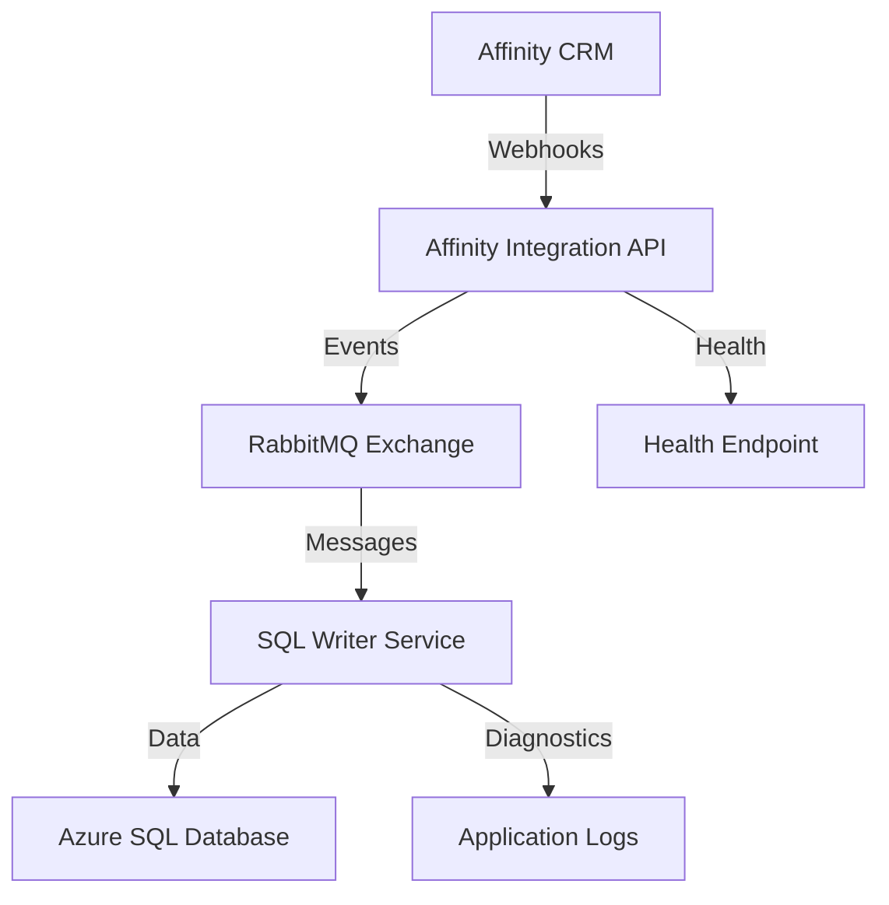

# KLIM.Integrations - Affinity Integration Platform

[](https://dotnet.microsoft.com/download/dotnet/8.0)
[](https://www.docker.com/)
[](https://www.rabbitmq.com/)
[](https://azure.microsoft.com/en-us/products/azure-sql/)

A comprehensive microservice integration platform for processing Affinity CRM webhooks, built with .NET 8, RabbitMQ, and Azure SQL Database. The solution follows KLIM.Events standards for enterprise-grade message routing and processing.

## ?? Table of Contents

- [Overview](#overview)
- [Architecture](#architecture)
- [Quick Start](#quick-start)
- [Project Structure](#project-structure)
- [Configuration](#configuration)
- [Development Setup](#development-setup)
- [Docker Deployment](#docker-deployment)
- [API Documentation](#api-documentation)
- [Monitoring & Diagnostics](#monitoring--diagnostics)
- [Contributing](#contributing)
- [Troubleshooting](#troubleshooting)

## ?? Overview

KLIM.Integrations is an enterprise-grade integration platform that:

- **Receives** Affinity CRM webhooks securely with authentication
- **Processes** webhook events with deduplication and correlation tracking
- **Publishes** standardized integration events to RabbitMQ
- **Persists** organization data to Azure SQL Database with UPSERT operations
- **Monitors** system health with comprehensive diagnostics and logging

### Key Features

? **Secure Webhook Processing** - HMAC-style secret authentication  
? **Event Deduplication** - SHA-256 based duplicate prevention  
? **Message Routing** - KLIM.Events compliant routing keys  
? **Database Integration** - Azure SQL with Azure AD authentication  
? **Health Monitoring** - Comprehensive health checks and diagnostics  
? **Docker Ready** - Full containerization with Docker Compose  
? **Enterprise Logging** - Structured logging with correlation IDs  
? **High Availability** - Designed for production deployment  

## ??? Architecture

### System Components



### Services

1. **KLIM.Integrations.Affinity** (`klim/affinity-integration`)
   - **Type**: ASP.NET Core Web API
   - **Purpose**: Webhook receiver and event publisher
   - **Port**: 8088
   - **Endpoints**: `/webhooks/affinity/{secret}`, `/health`

2. **KLIM.Integrations.Affinity.SqlWriter** (`klim/affinity-sql-writer`)
   - **Type**: .NET Worker Service (BackgroundService)
   - **Purpose**: Message consumer and database writer
   - **Features**: UPSERT operations, merge handling, diagnostics

3. **KLIM.Integrations.Contracts** 
   - **Type**: Shared library
   - **Purpose**: Common contracts, events, and infrastructure

### Event Flow

```
Affinity Webhook ? API Authentication ? Database Storage ? RabbitMQ Publish ? Consumer Processing ? Database UPSERT
```

## ?? Quick Start

### Prerequisites

- [.NET 8 SDK](https://dotnet.microsoft.com/download/dotnet/8.0)
- [Docker Desktop](https://www.docker.com/products/docker-desktop) (for containerized deployment)
- **Azure SQL Database** (or SQL Server)
- **RabbitMQ** (local, cloud, or containerized)

### 1. Clone and Setup

```bash
git clone <repository-url>
cd KLIM.Integrations

# Create environment configuration
cp .env.template .env
```

### 2. Configure Environment

Edit `.env` with your settings:

```bash
# Webhook Authentication Secret (generate with: openssl rand -hex 32)
WEBHOOKS__SECRET=your-secure-webhook-secret-here

# Azure SQL Database Connection
DATABASE__CONNECTIONSTRING=Server=your-server.database.windows.net;Database=your-db;Encrypt=true;TrustServerCertificate=false;Connection Timeout=30;
DATABASE__USEAZUREAD=true

# RabbitMQ Connection
RABBITMQ__HOST=localhost
RABBITMQ__USERNAME=guest
RABBITMQ__PASSWORD=guest
```

### 3. Quick Deploy with Docker

```bash
# Build and deploy all services
./deploy.sh deploy

# Or use Docker Compose directly
docker-compose up -d

# Verify deployment
curl http://localhost:8088/health
```

### 4. Test Webhook Endpoint

```bash
# Test webhook (replace with your secret)
curl -X POST "http://localhost:8088/webhooks/affinity/your-webhook-secret-here" \
  -H "Content-Type: application/json" \
  -d '{
    "type": "organization.created",
    "affinityOrganizationId": 123456,
    "name": "Test Organization",
    "domain": "test.com"
  }'
```

## ?? Project Structure

```
KLIM.Integrations/
??? src/
?   ??? KLIM.Integrations.Affinity/              # Web API Service
?   ?   ??? Infrastructure/
?   ?   ?   ??? IntegrationMessagePublisher.cs   # RabbitMQ publisher
?   ?   ?   ??? Sql.cs                           # Database helpers
?   ?   ??? Program.cs                           # API application entry point
?   ?   ??? Dockerfile                           # Container definition
?   ?
?   ??? KLIM.Integrations.Affinity.SqlWriter/    # Worker Service
?   ?   ??? Infrastructure/
?   ?   ?   ??? IntegrationDiagnosticService.cs  # Background diagnostics
?   ?   ??? Upsert/
?   ?   ?   ??? SqlUpserter.cs                   # Database operations
?   ?   ??? Program.cs                           # Worker application entry point
?   ?   ??? Dockerfile                           # Container definition
?   ?
?   ??? KLIM.Integrations.Contracts/             # Shared Library
?       ??? Events/                              # Event definitions
?       ?   ??? AffinityOrganizationCreatedV1.cs
?       ?   ??? AffinityOrganizationMergedV1.cs
?       ??? Infrastructure/                      # Common services
?           ??? DatabaseOptions.cs
?           ??? RabbitMQOptions.cs
?           ??? SqlAuthenticationService.cs
?           ??? WebhookOptions.cs
?
??? deploy/                                      # Deployment scripts
??? docker-compose.yml                           # Docker orchestration
??? .env.template                               # Environment configuration
??? build-docker.sh/.bat                       # Build scripts
??? deploy.sh                                  # Deployment script
??? DOCKER-DEPLOYMENT.md                      # Docker deployment guide
```

## ?? Configuration

### Environment Variables

#### Core Application Settings

| Variable | Description | Default | Required |
|----------|-------------|---------|----------|
| `ASPNETCORE_ENVIRONMENT` | Application environment | `Production` | No |
| `AFFINITY_INTEGRATION_PORT` | API external port | `8088` | No |
| `VERSION` | Docker image version | `latest` | No |

#### Webhook Configuration

| Variable | Description | Default | Required |
|----------|-------------|---------|----------|
| `WEBHOOKS__SECRET` | Webhook authentication secret | - | **Yes** |

> ?? **Security**: Generate webhook secret with `openssl rand -hex 32`

#### Database Configuration

| Variable | Description | Default | Required |
|----------|-------------|---------|----------|
| `DATABASE__CONNECTIONSTRING` | SQL Server connection string | - | **Yes** |
| `DATABASE__USEAZUREAD` | Use Azure AD authentication | `true` | No |
| `DATABASE__DIAGNOSTICSINTERVALMINUTES` | Diagnostics interval | `5` | No |

#### RabbitMQ Configuration (KLIM.Events Standards)

| Variable | Description | Default | Required |
|----------|-------------|---------|----------|
| `RABBITMQ__HOST` | RabbitMQ server hostname | `localhost` | **Yes** |
| `RABBITMQ__USERNAME` | RabbitMQ username | `guest` | **Yes** |
| `RABBITMQ__PASSWORD` | RabbitMQ password | `guest` | **Yes** |
| `RABBITMQ__EXCHANGENAME` | Exchange name | `klim.events` | No |
| `RABBITMQ__ENVIRONMENT` | Environment suffix | `integration` | No |
| `RABBITMQ__ROUTINGKEYPREFIX` | Routing key prefix | `klim.integration` | No |

#### Consumer Configuration

| Variable | Description | Default | Required |
|----------|-------------|---------|----------|
| `CONSUMER__QUEUENAME` | Consumer queue name | `klim.affinity.sqlwriter.integration` | No |
| `CONSUMER__BINDINGKEY` | Message binding pattern | `klim.integration.affinity.#` | No |
| `CONSUMER__PREFETCH` | Message prefetch count | `50` | No |

### Configuration Files

#### appsettings.json Structure

```json
{
  "Webhooks": {
    "Secret": "your-webhook-secret"
  },
  "Database": {
    "ConnectionString": "Server=...",
    "UseAzureAd": true,
    "DiagnosticsIntervalMinutes": 5
  },
  "RabbitMQ": {
    "Host": "localhost",
    "Username": "guest",
    "Password": "guest",
    "ExchangeName": "klim.events",
    "Environment": "integration",
    "RoutingKeyPrefix": "klim.integration"
  },
  "Consumer": {
    "QueueName": "klim.affinity.sqlwriter.integration",
    "BindingKey": "klim.integration.affinity.#",
    "Prefetch": 50
  }
}
```

## ??? Development Setup

### Local Development

#### 1. Install Prerequisites

```bash
# Install .NET 8 SDK
dotnet --version  # Should show 8.x.x

# Install Docker (optional, for RabbitMQ)
docker --version
```

#### 2. Setup Database

```sql
-- Create database schema (run against your SQL database)
-- Tables: aff.WebhookEvents, integration.AffinityOrganizations, dbo.Issuers
-- See deploy/sql/ for full schema scripts
```

#### 3. Setup RabbitMQ (Local)

```bash
# Option 1: Docker
docker run -d --name rabbitmq -p 5672:5672 -p 15672:15672 rabbitmq:3.12-management

# Option 2: Local installation
# Follow RabbitMQ installation guide for your OS
```

#### 4. Configure Development Environment

```bash
# Copy development template
cp .env.template .env.development

# Edit for local development
ASPNETCORE_ENVIRONMENT=Development
RABBITMQ__HOST=localhost
DATABASE__CONNECTIONSTRING=Server=localhost;Database=KlimDev;Integrated Security=true;
LOGGING__LOGLEVEL__DEFAULT=Debug
```

#### 5. Run Services Locally

```bash
# Terminal 1: Run API
cd src/KLIM.Integrations.Affinity
dotnet run

# Terminal 2: Run Worker Service
cd src/KLIM.Integrations.Affinity.SqlWriter
dotnet run

# Terminal 3: Monitor logs
tail -f logs/application.log
```

### Development Tools

#### Visual Studio / VS Code

```json
// .vscode/launch.json
{
  "version": "0.2.0",
  "configurations": [
    {
      "name": "Affinity API",
      "type": "coreclr",
      "request": "launch",
      "program": "${workspaceFolder}/src/KLIM.Integrations.Affinity/bin/Debug/net8.0/KLIM.Integrations.Affinity.dll",
      "args": [],
      "cwd": "${workspaceFolder}/src/KLIM.Integrations.Affinity",
      "env": {
        "ASPNETCORE_ENVIRONMENT": "Development"
      }
    }
  ]
}
```

#### Testing Webhooks

```bash
# Test webhook endpoint
./scripts/test-webhook.sh

# Or manually with curl
curl -X POST "http://localhost:8088/webhooks/affinity/test-secret" \
  -H "Content-Type: application/json" \
  -d @test-data/organization-created.json
```

## ?? Docker Deployment

### Docker Compose Deployment

#### 1. Production Deployment

```bash
# Configure production environment
cp .env.template .env.production
# Edit .env.production with production values

# Deploy with production config
ENV_FILE=.env.production docker-compose up -d

# Verify deployment
docker-compose ps
curl http://localhost:8088/health
```

#### 2. Development with Docker

```bash
# Use development environment
ASPNETCORE_ENVIRONMENT=Development docker-compose up -d

# Include RabbitMQ service (uncomment in docker-compose.yml)
docker-compose up -d rabbitmq

# Access RabbitMQ Management UI
open http://localhost:15672  # guest/guest
```

### Build and Push Images

#### Automated Build

```bash
# Build all images
./build-docker.sh

# Build with version tag
./build-docker.sh v1.2.3

# Build and push to registry
./build-docker.sh v1.2.3 --push
```

#### Manual Build

```bash
# Build individual images
docker build -t klim/affinity-integration:latest -f src/KLIM.Integrations.Affinity/Dockerfile .
docker build -t klim/affinity-sql-writer:latest -f src/KLIM.Integrations.Affinity.SqlWriter/Dockerfile .

# Multi-platform build
docker buildx build --platform linux/amd64,linux/arm64 -t klim/affinity-integration:latest --push .
```

### Deployment Management

```bash
# Service management
./deploy.sh deploy    # Deploy all services
./deploy.sh stop      # Stop services
./deploy.sh restart   # Restart services
./deploy.sh update    # Update to latest images
./deploy.sh logs      # View logs
./deploy.sh status    # Check status
./deploy.sh backup    # Backup configuration
./deploy.sh cleanup   # Clean up old resources
```

## ?? API Documentation

### Endpoints

#### Health Check
```http
GET /health
```

**Response:**
```json
{
  "status": "ok",
  "checks": {
    "database": {
      "status": "healthy",
      "webhooks": 1234,
      "lastReceivedAtUtc": "2024-01-15T10:30:00Z"
    },
    "bus": {
      "status": "healthy"
    },
    "timestampUtc": "2024-01-15T10:35:00Z"
  }
}
```

#### Webhook Receiver
```http
POST /webhooks/affinity/{secret}
Content-Type: application/json
```

**Request Body (Organization Created):**
```json
{
  "type": "organization.created",
  "affinityOrganizationId": 123456,
  "name": "ACME Corporation",
  "domain": "acme.com"
}
```

**Request Body (Organization Merged):**
```json
{
  "type": "organization.merged",
  "source": 123456,
  "target": 789012
}
```

**Response:**
```json
{
  "status": "accepted",
  "eventType": "organization.created",
  "deduplicated": false,
  "routingKey": "klim.integration.affinity.organization.created",
  "correlationId": "a1b2c3d4e5f6"
}
```

### Event Contracts

#### AffinityOrganizationCreatedV1
```csharp
public record AffinityOrganizationCreatedV1
{
    public long AffinityOrganizationId { get; init; }
    public string? Name { get; init; }
    public string? Domain { get; init; }
}
```

#### AffinityOrganizationMergedV1
```csharp
public record AffinityOrganizationMergedV1
{
    public long Source { get; init; }
    public long Target { get; init; }
}
```

### Routing Keys (KLIM.Events Standards)

| Event Type | Routing Key Pattern |
|------------|-------------------|
| Organization Created | `klim.integration.affinity.organization.created` |
| Organization Merged | `klim.integration.affinity.organization.merged` |
| Unknown Events | Not published (stored only) |

## ?? Monitoring & Diagnostics

### Health Monitoring

#### Service Health
```bash
# Check overall health
curl http://localhost:8088/health

# Monitor health continuously
watch -n 5 curl -s http://localhost:8088/health | jq .
```

#### Container Health
```bash
# Check container health
docker-compose ps

# Monitor resource usage
docker stats klim-affinity-integration klim-affinity-sql-writer

# View container logs
docker-compose logs -f --tail=100
```

### Logging

#### Log Levels
- **Information**: Normal operation, webhook processing
- **Warning**: Large payloads, recoverable errors
- **Error**: Database failures, RabbitMQ connection issues

#### Structured Logging
```json
{
  "timestamp": "2024-01-15T10:30:00.123Z",
  "level": "Information",
  "message": "Webhook organization.created processed",
  "correlationId": "a1b2c3d4e5f6",
  "source": "affinity.webhook",
  "eventType": "organization.created",
  "routingKey": "klim.integration.affinity.organization.created"
}
```

#### Log Aggregation
```bash
# View all service logs
./deploy.sh logs

# View specific service
./deploy.sh logs affinity-integration
./deploy.sh logs affinity-sql-writer

# Follow logs in real-time
docker-compose logs -f --since=10m
```

### Metrics and Alerts

#### Application Metrics
- **Webhook Processing Rate**: Events/minute
- **Database Connection Health**: Success/failure rates
- **RabbitMQ Message Flow**: Publish/consume rates
- **Payload Size Monitoring**: Large payload detection

#### Recommended Alerts
- Health endpoint returning "degraded" or "unhealthy"
- Database connection failures
- RabbitMQ connection lost
- High error rates in logs
- Container restarts

## ?? Contributing

### Development Workflow

1. **Fork** the repository
2. **Create** a feature branch (`git checkout -b feature/amazing-feature`)
3. **Make** your changes following the coding standards
4. **Test** your changes thoroughly
5. **Commit** your changes (`git commit -m 'Add amazing feature'`)
6. **Push** to the branch (`git push origin feature/amazing-feature`)
7. **Open** a Pull Request

### Coding Standards

- Follow [C# Coding Conventions](https://docs.microsoft.com/en-us/dotnet/csharp/fundamentals/coding-style/coding-conventions)
- Use **nullable reference types** (enabled by default)
- Add **XML documentation** for public APIs
- Write **unit tests** for new functionality
- Follow **KLIM.Events standards** for message routing

### Testing

```bash
# Run unit tests
dotnet test

# Run integration tests
dotnet test --filter Category=Integration

# Generate test coverage
dotnet test --collect:"XPlat Code Coverage"
```

## ?? Troubleshooting

### Common Issues

#### 1. Health Check Failures

**Symptoms**: `/health` endpoint returns "degraded" or "unhealthy"

**Solutions**:
```bash
# Check database connectivity
sqlcmd -S your-server.database.windows.net -d your-database -G

# Verify RabbitMQ connection
telnet localhost 5672

# Check logs for specific errors
./deploy.sh logs affinity-integration | grep -i error
```

#### 2. Webhook Authentication Failures

**Symptoms**: `401 Unauthorized` responses

**Solutions**:
```bash
# Verify webhook secret matches
echo $WEBHOOKS__SECRET

# Test with correct secret
curl -X POST "http://localhost:8088/webhooks/affinity/correct-secret" -d '{}'
```

#### 3. Database Connection Issues

**Symptoms**: Database health check fails, SQL errors in logs

**Solutions**:
```bash
# Verify connection string
echo $DATABASE__CONNECTIONSTRING

# Check Azure AD authentication
# Ensure container has proper network access to Azure
# Verify firewall rules allow container IP

# Test connection manually
dotnet run --connection-test
```

#### 4. RabbitMQ Message Flow Issues

**Symptoms**: Messages not being processed, queue backing up

**Solutions**:
```bash
# Check RabbitMQ Management UI
open http://localhost:15672

# Verify queue bindings and routing keys
# Check exchange configuration
# Monitor consumer prefetch settings

# Restart SQL Writer service
docker-compose restart affinity-sql-writer
```

#### 5. Container Startup Issues

**Symptoms**: Containers failing to start or crashing

**Solutions**:
```bash
# Check container logs
docker logs klim-affinity-integration
docker logs klim-affinity-sql-writer

# Verify environment variables
docker exec klim-affinity-integration env | grep -E "(DATABASE|RABBITMQ|WEBHOOKS)"

# Check resource constraints
docker stats

# Rebuild images
./build-docker.sh --no-cache
```

### Debug Mode

Enable debug logging for troubleshooting:

```bash
# Set debug logging level
export LOGGING__LOGLEVEL__DEFAULT=Debug

# Or in .env file
LOGGING__LOGLEVEL__DEFAULT=Debug
LOGGING__LOGLEVEL__MICROSOFT=Debug
LOGGING__LOGLEVEL__MASSTRANSIT=Debug

# Restart services
./deploy.sh restart
```

### Performance Issues

#### Database Performance
```sql
-- Check webhook event table size
SELECT COUNT(*) FROM aff.WebhookEvents;

-- Monitor long-running queries
SELECT * FROM sys.dm_exec_requests WHERE command != 'AWAITING COMMAND';

-- Index usage statistics
SELECT * FROM sys.dm_db_index_usage_stats WHERE database_id = DB_ID();
```

#### RabbitMQ Performance
```bash
# Check queue depth
rabbitmqctl list_queues name messages

# Monitor connection statistics
rabbitmqctl list_connections

# Check memory usage
rabbitmqctl status | grep memory
```

### Log Analysis

```bash
# Find correlation ID across services
grep "correlationId=abc123" /var/log/klim/*.log

# Monitor error patterns
grep -i "error\|exception\|failed" /var/log/klim/affinity-*.log | tail -20

# Count webhook events by type
grep "eventType" /var/log/klim/affinity-integration.log | cut -d'"' -f4 | sort | uniq -c
```

---

## ?? Support & Documentation

- **Docker Deployment**: See [DOCKER-DEPLOYMENT.md](DOCKER-DEPLOYMENT.md)
- **KLIM.Events Standards**: See [KLIM-Events-RabbitMQ-Standards.md](KLIM-Events-RabbitMQ-Standards.md)
- **Database Schema**: See `deploy/sql/` directory
- **Configuration Reference**: See `.env.template`

## ?? License

This project is licensed under the MIT License - see the [LICENSE](LICENSE) file for details.

---

**?? Ready to integrate? Start with our [Quick Start](#quick-start) guide!**